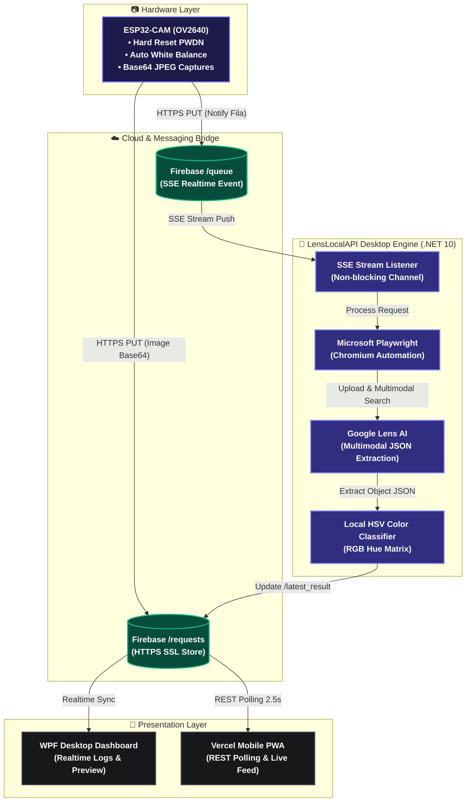

<div align="center">

<pre>
    ██╗      ███████╗███╗   ██╗███████╗██╗      ██████╗  ██████╗ █████╗ ██╗      █████╗ ██████╗ ██╗
    ██║      ██╔════╝████╗  ██║██╔════╝██║     ██╔═══██╗██╔════╝██╔══██╗██║     ██╔══██╗██╔══██╗██║
    ██║      █████╗  ██╔██╗ ██║███████╗██║     ██║   ██║██║     ███████║██║     ███████║██████╔╝██║
    ██║      ██╔══╝  ██║╚██╗██║╚════██║██║     ██║   ██║██║     ██╔══██╗██║     ██╔══██╗██╔═══╝ ██║
    ███████╗ ███████╗██║ ╚████║███████╗███████╗╚██████╔╝╚██████╗██║  ██║███████╗██║  ██║██║     ██║
    ╚══════╝ ╚══════╝╚═╝  ╚═══╝╚══════╝╚══════╝ ╚═════╝  ╚═════╝╚═╝  ╚═╝╚══════╝╚═╝  ╚═╝╚═╝     ╚═╝
</pre>

<p><b>IoT Computer Vision Platform · Zero API Cost · Powered by Google Lens & Firebase</b></p>


</div>

---

## What is LensLocalAPI?

**LensLocalAPI** is a professional, open-source IoT computer vision platform that turns an ultra-affordable ($4) ESP32-CAM module into an AI-powered object and color recognition engine.

Stop paying expensive subscription fees for commercial Vision APIs. Capture photos on hardware, process them instantly through automated Google Lens multimodal search, and stream results to your mobile phone in real time.

```text
ESP32-CAM (.jpg) → LensLocalAPI → Firebase & Mobile App
```

Designed for speed, reliability, and zero-cost MVP product development.

## How it Works

LensLocalAPI provides a seamless computer vision pipeline using a real-time Server-Sent Events (SSE) streaming model:



---

## 🔧 Setup & Configuration Guide (Step-by-Step)

### 1. Firebase Project Setup
1. Go to the [Firebase Console](https://console.firebase.google.com/) and create a new project.
2. In the left menu, navigate to **Build → Realtime Database** and click **Create Database**.
3. Under the **Rules** tab, set public read/write access for testing:
   ```json
   {
     "rules": {
       ".read": true,
       ".write": true
     }
   }
   ```
4. Copy your Realtime Database URL (e.g. `https://your-project-id-default-rtdb.firebaseio.com`).

---

### 2. ESP32-CAM Firmware Setup (`/esp32cam_firmware`)
1. Open `esp32cam_firmware/esp32cam_firmware.ino` in Arduino IDE.
2. Update lines 22-24 with your Wi-Fi network and Firebase Database URL:
   ```cpp
   const char* WIFI_SSID     = "YOUR_WIFI_SSID";
   const char* WIFI_PASSWORD = "YOUR_WIFI_PASSWORD";
   const char* FIREBASE_URL  = "https://your-project-id-default-rtdb.firebaseio.com";
   ```
3. In Arduino IDE, select board **AI Thinker ESP32-CAM** and flash the sketch.

---

### 3. Desktop Application Setup (C# .NET WPF)
You can configure your Firebase connection using **either** of the following methods:

- **Method A (GUI):** Run `iniciar.bat`, click **Configurar Firebase** in the top header, paste your Database URL, and click **Salvar e Conectar**.
- **Method B (`appsettings.json`):** Open `appsettings.json` and paste your Database URL:
  ```json
  {
    "Firebase": {
      "DatabaseUrl": "https://your-project-id-default-rtdb.firebaseio.com",
      "QueuePath": "queue",
      "RequestsPath": "requests"
    }
  }
  ```

---

### 4. Deploying the Mobile Web App to Vercel (`/web`)

To view live ESP32 recognition results on your smartphone:

#### Option A: Vercel CLI (1-Click Command)
```bash
cd web
npx vercel --prod
```

#### Option B: Vercel Dashboard (GitHub / Git Import)
1. Open `web/index.html` and paste your Firebase Database URL in line 224:
   ```javascript
   const firebaseConfig = {
       databaseURL: "https://your-project-id-default-rtdb.firebaseio.com"
   };
   ```
2. Go to [Vercel Dashboard](https://vercel.com/new), import your repository, and set the Root Directory to `web`.
3. Click **Deploy**. Your mobile dashboard will be live at `https://your-app.vercel.app`!

---

## Features

*   **Zero API Costs** — Unlimited visual recognition powered by Google Lens multimodal AI.
*   **Local HSV Color Classification** — Local C# algorithm for instant Portuguese color name classification.
*   **Realtime SSE Streaming** — Sub-second event triggers using Firebase Realtime Database.
*   **Hardware Stability** — Hardened ESP32-CAM C++ firmware with Auto White Balance, AEC, and PWDN hardware resets.
*   **Cross-Platform Mobile PWA** — Responsive Vercel-ready dashboard for tracking captures on any smartphone.
*   **Customizable UI** — Built-in Firebase configuration manager with live latency and health indicators.

## Tech Stack

| Component | Technology |
|---|---|
| **Desktop Engine** | .NET 10 WPF, C# 12 |
| **Browser Automation** | Microsoft Playwright, Chromium |
| **Hardware Firmware** | ESP32-CAM (OV2640 C++), Arduino Core 3.x |
| **Cloud & Database** | Firebase Realtime Database (SSE), Vercel |
| **Frontend Web App** | HTML5, CSS3, ES6 Modules |

## Deployment

**LensLocalAPI** comes ready out of the box.

```bash
# To run locally on Windows:
iniciar.bat
```

**Required ESP32 Settings:**
- **Board:** AI Thinker ESP32-CAM
- **Flash Frequency:** 80MHz
- **Partition Scheme:** Huge APP (3MB No OTA/1MB SPIFFS)

## Project Structure

```text
LensLocalAPI/
├── LensLocalAPI.csproj   # .NET 10 WPF project manifest
├── ViewModels/           # MainViewModel & RelayCommand logic
├── Views/                # MainWindow WPF dark UI & controls
├── Services/             # GoogleLensService, FirebaseService, ColorAnalyzer
├── Models/               # Data structures & config schemas
├── esp32cam_firmware/    # ESP32-CAM C++ firmware sketch
├── web/                  # Vercel-ready mobile dashboard
└── iniciar.bat           # 1-click startup script
```

<div align="center">
Made by Herick B.
</div>
